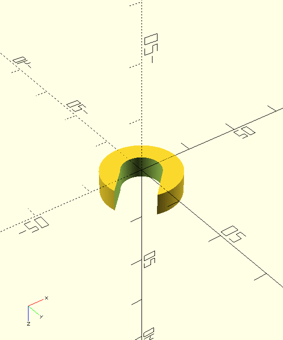

# Voron Tools

## Introduction
When assembling my voron 2.4r2, I found I needed some tools. So this repo
is dedicated to 3dprints/scripts and others related to building a voron printer.

### zspacer.stl

Part is designed for the CNC voron parts, in the Z-retarder Assembly, to put space between the small pully and the small bearing. 

